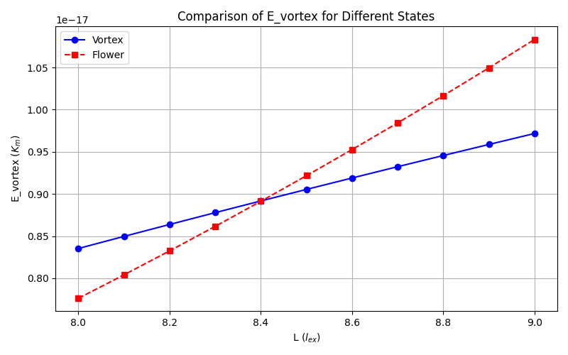
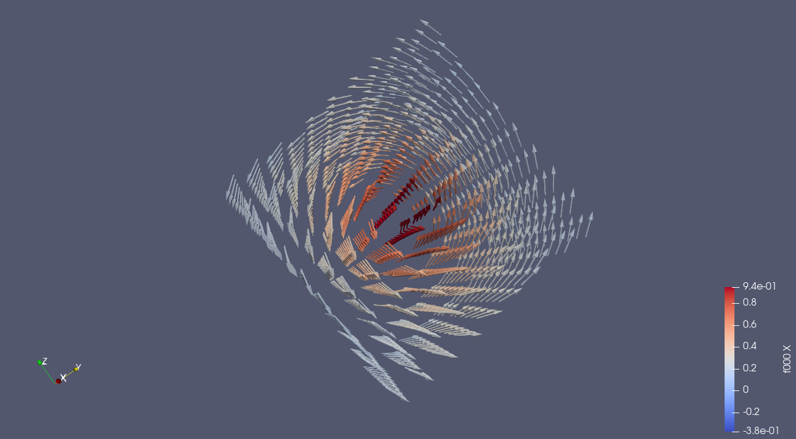

# README

## Exercise 
A cube with edge length, L, 
expressed in units of the intrinsic length scale, $l_{ex} = (A/K_m)^{1/2}$, 
where $K_m$ is a magnetostatic energy density, $K_m = 1/2\mu_0M_s^2$ (SI) or $2piM_s^2$ (cgs emu). 

See the full [exercise description](microMAG%20Standard%20Problem%20nr3.pdf).
## Desired output for comparison: 

### Task 1
- The indicated "single domain limit", L, where the energy of the flower state is equal to the energy of the vortex state.  
**Answer**: The "single domain limit", L, is at 8.4 $l_{ex}$ for both flower state and vortex state.

#### Plotting energy vs L for both states  

> Point of intersection at L=8.4, where energies are equivalent for both states. 

#### Magnetization in vortex state

> Glyph arrows in ParaView show direction of magnetization in X contribution. 

### Task 2
- The partial energies (exchange, stray field, anisotropy) all in units of Km .   
**Answer**: 

### Task 3
- The average magnetization along the three axes.  
**Answer**: 
